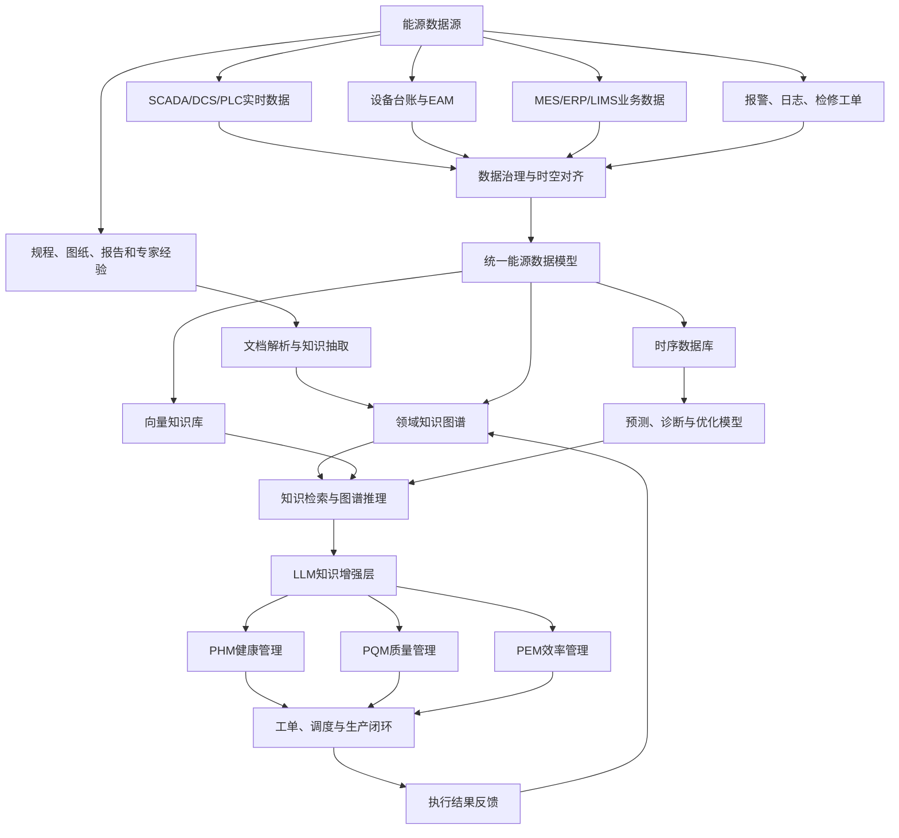
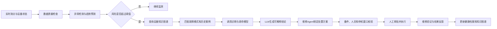
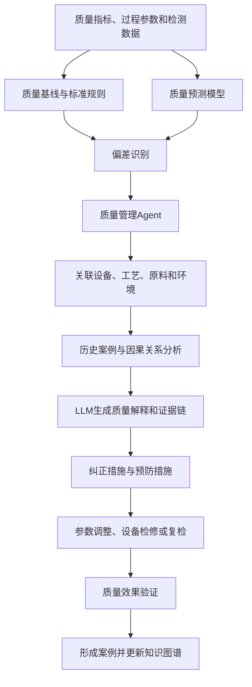
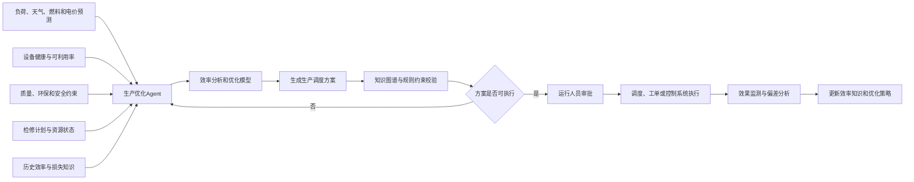
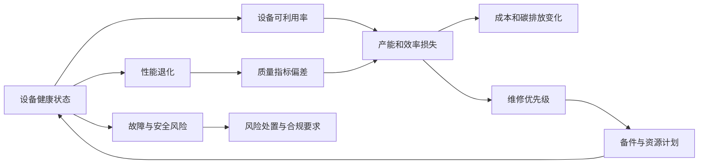

## 一、引言：能源企业需要“知识驱动”的智能管理

能源生产具有连续运行、设备复杂、工艺耦合、安全约束严格等特点。火电、风电、光伏、储能、石油天然气以及综合能源站都配置了大量设备和信息系统，例如SCADA、DCS、PLC、MES、EAM、ERP、LIMS、视频监控和检修管理系统。这些系统积累了海量的测点数据、报警记录、生产报表、检修工单、质量数据和专家经验，但数据之间往往彼此割裂。

传统系统能够展示曲线、统计指标和触发报警，却难以回答以下问题：某个设备异常可能由什么原因造成？该异常会不会进一步影响产品质量和生产效率？过去是否发生过类似故障？应该安排什么检修任务？不同处置方案对产量、能耗和安全风险有什么影响？

知识图谱可以把设备、部件、参数、故障、工艺、质量、能耗、工单和人员等对象连接起来，形成能源领域的语义网络。大语言模型（LLM）擅长理解自然语言、总结复杂信息、生成解释性报告和调用外部工具。AI Agent则能够围绕目标进行任务拆解，访问数据库、调用分析模型、查询知识图谱、生成处置方案并推动业务流程执行。三者融合后，可以构建面向设备健康、生产质量和生产效率的统一智能管理体系。

需要强调的是，LLM并不直接替代专业的机理模型、时序模型和控制系统。它更适合作为“知识理解和任务编排中枢”；知识图谱承担结构化知识组织、关联和推理；AI Agent负责将分析结果转化为可执行的业务行动。

---

## 二、总体架构：从数据、知识到智能行动

能源企业的智能管理知识图谱应当是一个动态知识系统，而不是静态设备台账。图谱中的对象包括设备、部件、测点、工艺参数、故障模式、质量指标、效率指标、维修措施、工单、备件、环境条件和安全约束等。

例如，图谱可以表示如下关系：

> 风力发电机组包含齿轮箱，齿轮箱包含高速轴承，高速轴承具有振动和温度测点；轴承温度持续升高可能与润滑不足有关；润滑不足可能导致轴承磨损；轴承磨损需要安排检查或更换；该维修活动又会影响机组可利用率和发电量。

与普通知识图谱相比，能源领域图谱还应加入时间、状态、概率和因果信息。同一台设备在不同时间、不同负荷和不同环境条件下，健康状态并不相同。因此，图谱应能够描述“某设备在某时间段处于何种状态”“某异常在何种工况下更容易发生”“某措施是否经过验证有效”。

系统运行时，实时数据进入时序数据库，设备结构和业务关系进入知识图谱，规程、报告和日志进入向量知识库。模型负责异常检测、故障诊断、剩余寿命预测、质量预测和效率优化；LLM通过检索增强生成（RAG）获取相关图谱关系、历史案例和制度文件，再形成有证据、有来源的回答。AI Agent则通过工具调用连接模型和业务系统。

---

## 三、在PHM中的应用：从异常发现到维修决策

设备预诊断和健康管理PHM的核心任务包括状态监测、异常检测、故障诊断、寿命预测和维修决策。传统PHM模型通常专注于某个设备或某组传感器，能够输出异常分数，却不一定能够解释异常的业务含义。知识图谱可以把异常测点放回设备结构、故障机理和历史维修背景中进行分析。

以风电机组齿轮箱为例，状态监测模型发现高速轴承振动幅值在72小时内持续上升，同时润滑油温度高于同类机组平均水平。系统首先查询该机组的型号、运行年限、最近一次换油时间、历史故障和当前风速、负荷等信息，再通过图谱查找“振动升高—润滑不足—轴承磨损—齿轮啮合异常”等故障链。若历史案例显示该型号齿轮箱曾多次出现滤芯堵塞，诊断Agent就会将“润滑油过滤器堵塞”列为优先检查原因，而不是直接给出笼统的“齿轮箱故障”。

LLM在这一过程中主要承担三项工作。第一，将运行人员的自然语言问题转换成图谱查询和数据查询，例如“最近一周哪些风机存在齿轮箱早期风险”。第二，将时序模型结果、知识图谱关系和维修规程组织成诊断说明。第三，把复杂的技术结论转换成不同对象能够理解的内容，例如给检修人员输出检查步骤，给管理人员输出风险等级和可能的发电损失。

PHM中的AI Agent可以自主完成“发现—分析—验证—处置—反馈”流程。它先监测关键测点和模型输出，发现异常后调用设备知识图谱和历史案例库，接着调用故障诊断模型或数字孪生模型，比较不同故障假设。对于高风险异常，Agent可查询备件库存、人员资质、计划停机窗口和安全规程，形成维修建议；对于暂不需要停机的异常，则生成加强监测方案。最终，系统把建议提交给运行或检修人员审批，必要时自动生成工单。

在剩余寿命预测方面，模型给出轴承、变压器绝缘系统、风机叶片或储能电池的寿命区间，知识图谱则进一步关联故障后果和生产任务。例如，某储能电池簇预计还有三个月进入高风险区间，但未来两周正处于电网调峰高峰期。系统可建议短期降额运行，并将更换任务安排在低负荷时段。这样，寿命预测不再是一个孤立的数值，而是转化为考虑安全、生产和经济性的决策。

---

## 四、在PQM中的应用：从质量追溯到质量预测

能源领域的生产质量不仅包括传统意义上的产品质量，还包括供电质量、蒸汽质量、燃气质量、环保排放质量和检维修质量。例如，电能质量涉及电压、频率、谐波和功率因数；火电生产质量涉及主蒸汽温度、压力、排烟温度、煤耗和污染物排放；储能系统则关注容量、效率、电池一致性和热安全。

传统质量管理多在结果出现后进行检测和追责。融合知识图谱后，可以建立“原料—设备—工艺—操作—环境—质量结果”的完整关联。系统不仅能够判断某个指标是否超限，还能分析偏差形成的路径。

例如，燃气电站出现NOx排放升高。质量Agent可以同时查询燃气热值和组分、机组负荷、燃烧室温度、氧量、空燃比、燃烧器检修记录以及同类历史事件。图谱中的因果关系可能表明：燃气组分变化导致热值升高，空燃比未及时调整，进而使燃烧温度升高并造成NOx排放增加；也可能是燃烧器喷嘴积碳，造成局部燃烧不均匀。系统会结合模型计算、规则约束和历史案例，对不同原因进行排序，并给出证据来源。

PQM中的LLM适合处理大量非结构化质量知识。它可以从质量报告、异常记录、实验室化验单、班组日志和整改报告中抽取质量问题、影响因素、责任环节和纠正措施，并将这些内容关联到设备和工艺节点。运行人员可以直接询问：“本月蒸汽温度波动最大的原因是什么？”系统通过图谱检索相关时段的设备状态、负荷变化和操作记录，调用因果分析模型后生成带有数据证据的说明。

AI Agent则推动质量问题闭环。它可以识别质量偏差，判断是否可能是仪表异常，调用根因分析模型，查找相似案例，生成纠正措施和预防措施，发起质量工单，并在整改完成后自动检查指标是否恢复。如果措施没有产生预期效果，Agent可以重新打开问题并升级处理。

这种方式将质量管理从“结果检验”转变为“过程预测”。例如，当锅炉效率下降、排烟温度升高、氧量偏离时，系统可以在排放超限或煤耗明显上升之前，提醒运行人员检查受热面结渣、漏风或燃烧配比问题。

---

## 五、在PEM中的应用：从效率统计到生产优化

生产效率管理PEM关注能源生产过程中的产量、能耗、设备利用率、生产成本、停机损失和碳排放。效率问题通常具有多因素特征。风电场发电量下降可能来自风资源不足、偏航误差、叶片污染、设备降额、故障停机或电网限电；火电机组煤耗上升可能由负荷率变化、受热面污染、给水温度下降、燃烧调整不合理或设备性能退化共同造成。

知识图谱能够将效率指标与设备健康、运行工况、环境条件、检修事件和调度指令关联起来。系统可以把实际产出与理论产出进行分解，识别效率损失来源。例如：

> 机组当日发电量下降，其中风资源影响占40%，设备非计划停机影响占25%，叶片性能退化影响占15%，电网限电影响占20%。

这种分解比单纯显示“发电量下降”更有管理价值，因为不同损失需要采取不同措施。

PEM Agent可以围绕生产目标自动组织优化任务。它读取负荷预测、天气预测、燃料价格、机组效率曲线、设备健康状态、环保约束和检修计划，调用机组组合优化、负荷分配或能源调度模型，生成运行方案。知识图谱负责提供设备边界、工艺约束、操作规程和设备风险信息，避免优化模型产生无法执行或不安全的建议。LLM则解释方案的原因、预期收益和可能风险。

例如，系统可以建议由健康度较高、热耗较低的机组承担基荷，由调节速率较快但效率略低的机组承担调峰，同时限制存在轴承温升风险的机组负荷。方案经过安全规则校验和人员审批后，才进入调度系统或生产执行系统。

PEM并非只追求产量最大化，而是在安全和质量约束下实现综合效益最优。知识图谱可以把“效率提升”与“设备寿命消耗”联系起来。例如，短期提高设备负荷可能增加发电量，但也可能加剧关键部件老化。因此，PEM Agent应当同时读取PHM结果和PQM约束，实现产量、成本、可靠性和碳排放之间的平衡。

---

## 六、PHM、PQM与PEM的统一融合

PHM、PQM和PEM不应建设成三个互不相干的系统。设备健康会影响生产质量和效率，质量异常可能反映设备退化，效率下降也可能增加设备运行风险。统一知识图谱能够建立三者之间的因果和业务联系。

以储能电站为例，电池簇温差持续增大。PHM系统判断电芯一致性下降或液冷系统异常，给出热失控风险；PQM系统发现该电池簇的充放电效率和可用容量低于标准；PEM系统则计算出该电池簇降额运行会造成的调度收益损失。综合Agent最终建议：短期限制充放电倍率，加强温度监测；中期安排冷却系统检查和电芯一致性测试；长期根据容量衰减情况制定更换计划。

在统一架构下，可以设置健康管理Agent、质量管理Agent、效率管理Agent和调度协调Agent。它们共享同一个知识图谱，但拥有不同的职责和权限。健康管理Agent负责设备状态与维修建议，质量管理Agent负责质量风险和整改闭环，效率管理Agent负责损失分析与优化，协调Agent负责处理多个目标之间的冲突。

---

## 七、落地实施与安全要求

建设此类系统不能一开始就追求覆盖全部设备和全部业务。更适合从一个高价值场景切入，例如风机齿轮箱预警、火电锅炉效率优化、储能电池健康管理或燃气轮机排放预测。首先统一设备编码、测点定义、故障分类、质量指标和工单标准，然后逐步扩展到更多设备和业务。

技术上，应采用“关系库、时序库、知识图谱和向量库协同”的架构。关系数据库保存台账和事务数据，时序数据库保存测点数据，知识图谱保存实体关系、因果链、约束和案例，向量库保存规程、报告和日志。LLM通过RAG获得可信知识，不能仅依靠模型记忆回答专业问题。

能源系统具有安全关键属性，AI Agent必须受到严格约束。关键控制指令不能由Agent直接执行，必须经过权限控制、规则校验和人工审批。所有诊断结论应保留数据时间、数据来源、使用模型、引用规程和置信度。对模型漂移、传感器失效、知识冲突和异常输出也应建立监测机制。

系统效果可以从三方面评价：PHM关注预警提前量、误报率、非计划停机时间和维修成本；PQM关注质量异常提前发现率、重复缺陷率、排放超限次数和问题闭环周期；PEM关注设备利用率、单位能耗、产能损失、运行成本和碳排放强度。

## 八、结语

融合知识图谱、LLM和AI Agent的能源智能管理系统，本质上是把分散的数据、专业知识、分析模型和业务流程连接为一个闭环。知识图谱解决“设备、工艺、质量和效率之间如何关联”的问题；LLM解决“如何理解复杂信息并形成可解释结论”的问题；AI Agent解决“如何围绕目标调用工具并推动行动”的问题。

在PHM中，它能够从单点报警发展为面向故障机理和维修资源的预诊断；在PQM中，它能够从事后检验发展为面向过程的质量预测和根因闭环；在PEM中，它能够从指标统计发展为综合考虑设备健康、生产质量、安全约束和经济收益的优化决策。三者通过统一知识图谱实现联动，最终形成“感知—分析—决策—执行—验证—学习”的能源生产智能闭环。
